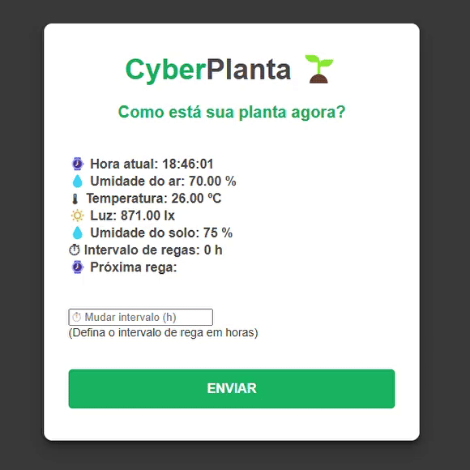

### Oi, eu sou Vitor! ☕

  

    

      🇺🇸 About me
    

    

      - 🤖 I currently work with IoT, Robotics, Computer Vision and Automation.  
      - 🧠 Currently studying Computer Vision with C++.  
      - 💻 I can collaborate on AI and Machine Learning projects.  
      - 🤜🤛 I accept help with OpenCV and YOLO.  
      - 🛰 I answer questions about Robotics, Embedded Systems, and some about Satellites.  
      - 📺 https://instagram.com/shaftrobotica  
      - 💼 https://www.linkedin.com/in/vitor-domingues-4852a62a8/  
       
    

  

  

    

      🇧🇷 Sobre mim 
    

  - 🤖 Trabalho atualmente com IoT, Robótica, Visão Computacional e Automação.  
  - 🧠 Atualmente estudando Visão Computacional com C++.  
  - 💻 Posso colaborar em projetos de I.A. e Machine Learning.  
  - 🤜🤛 Aceito ajudas com OpenCV e YOLO.  
  - 🛰 Respondo dúvidas sobre Robótica, Sistemas Embarcados e algumas sobre Satélites.  
  - 📺 https://instagram.com/shaftrobotica  
  - 💼 https://www.linkedin.com/in/vitor-domingues-4852a62a8/  
   
    

  

 

#### Principais projetos:

  

    
    
Cyberplanta - IoT

  

  

    
    
Visual Servoing

  

  

    
    
Kalman Tracker

  

  

    
    
Accelerometer 3D Cube

  

 
  
  
  
  
  
  
  
  
  

 